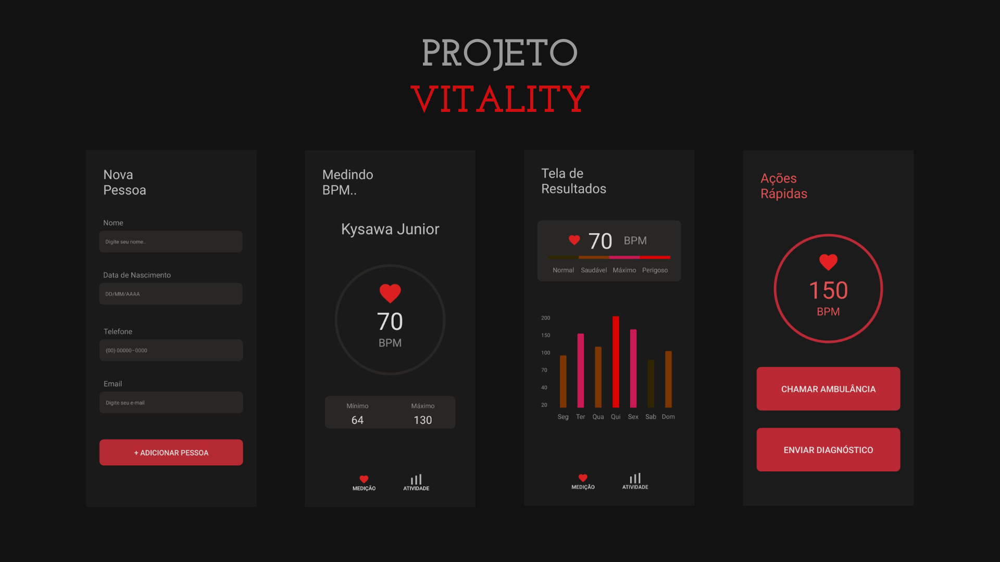

## Vitality
#### Este é um Projeto feito para meu TCC na ETEC Monsenhor Antônio Magliano. Foi desenvolvido utilizando Java e a Biblioteca Android (utilizando XML), afim de monitorar e computar dados dos batimentos cardiacos de um paciente, através de um aparelho. O Aparelho utilizado foi um SmartWatch.
